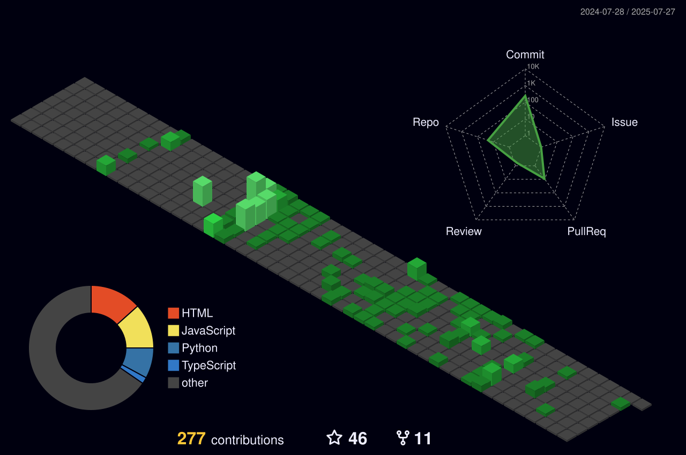

<h1 align="center">Hi 👋, I'm Uttam Kumar</h1>
<h3 align="center">A passionate Full Stack Web Developer from India</h3>

  

  

<!-- - 🔭 I’m currently working on [BlogApp](https://github.com/uttam9721/vlogApp) -->

- 🔍 I’m currently seeking opportunities as a Frontend / Full Stack Developer

- 👨‍💻 All of my projects are available at [https://modexa.in/](https://modexa.in/)

- 💬 Ask me about **MERN STACK**

- 📫 How to reach me **uttammaurya377@gmail.com**

- 📄 Know about my experiences [https://drive.google.com/file/d/1mtehefT6YaOwWgDU_B4YAJewMup0AOmV/view?usp=drivesdk](https://drive.google.com/file/d/1mtehefT6YaOwWgDU_B4YAJewMup0AOmV/view?usp=drivesdk)

<h3 align="left">Connect with me:</h3>

<h3 align="left">Languages and Tools:</h3>

                 

&nbsp;

#### Github Analytics:
 

<markdown-accessiblity-table data-catalyst="">
  <table style="width: 100%; background-color: #1e1e1e; color: white; table-layout: fixed;">
    <thead>
	    <tr>
		  <th colspan="2" align="center">
			   
		  </th>
		</tr>
      <tr>
        <th style="padding: 20px; text-align: center;">
          
        </th>
        <th style="padding: 20px; text-align: center;">
          
        </th>
      </tr>
    </thead>		
</markdown-accessiblity-table>

